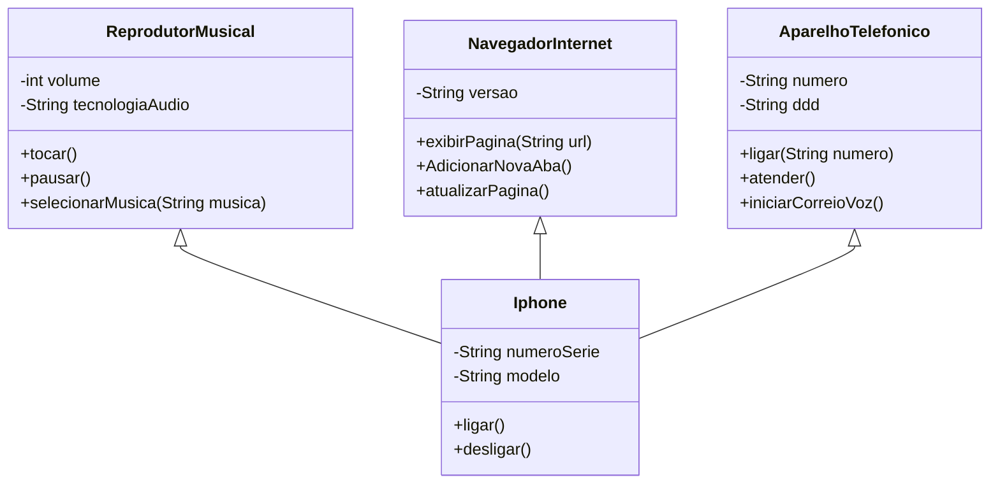

# Diagrama UML (Mermaid)

```mermaid
    classDiagram
        ReprodutorMusical <|-- Iphone
        NavegadorInternet <|-- Iphone
        AparelhoTelefonico <|-- Iphone
        class Iphone {
            -String numeroSerie
            -String modelo
            +ligar()
            +desligar()
        }
        class ReprodutorMusical {
            -int volume
            -String tecnologiaAudio
            +tocar()
            +pausar()
            +selecionarMusica(String musica)
        }
        class NavegadorInternet {
            -String versao
            +exibirPagina(String url)
            +AdicionarNovaAba()
            +atualizarPagina()
        }
        class AparelhoTelefonico {
            -String numero
            -String ddd
            +ligar(String numero)
            +atender()
            +iniciarCorreioVoz()
        }
```